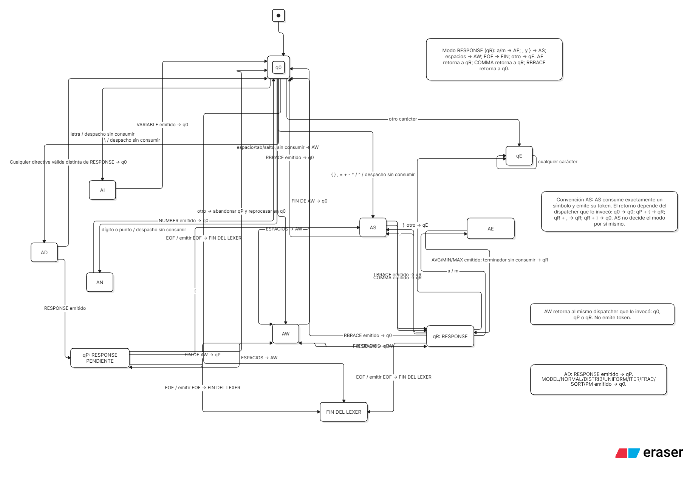
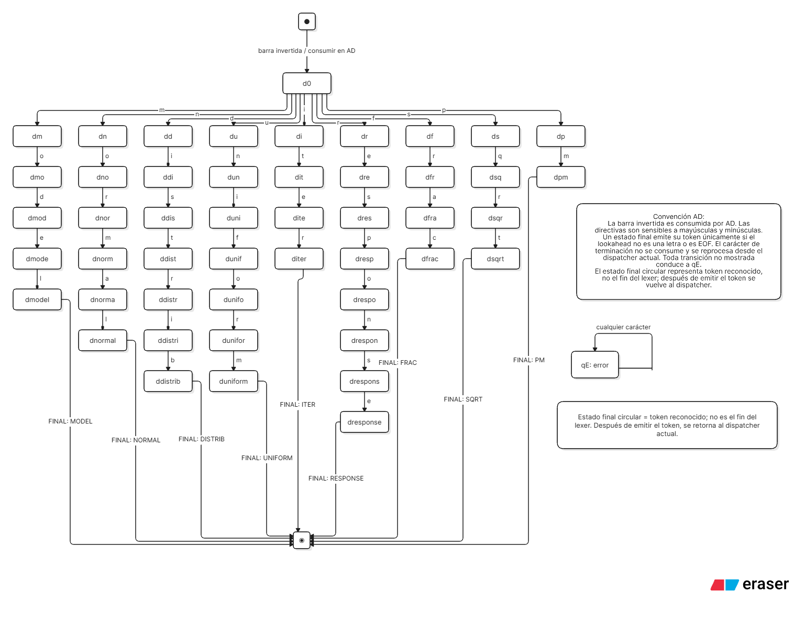
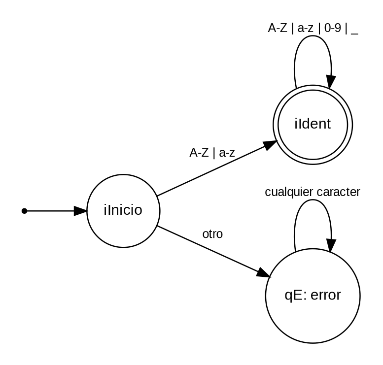
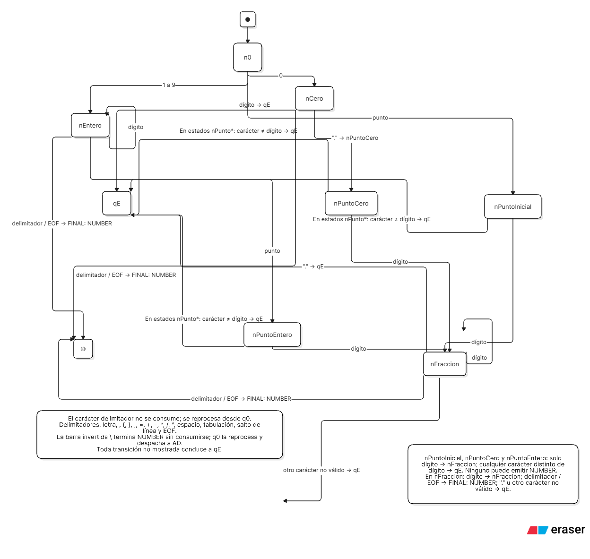
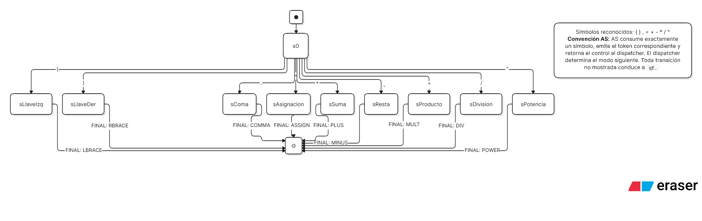
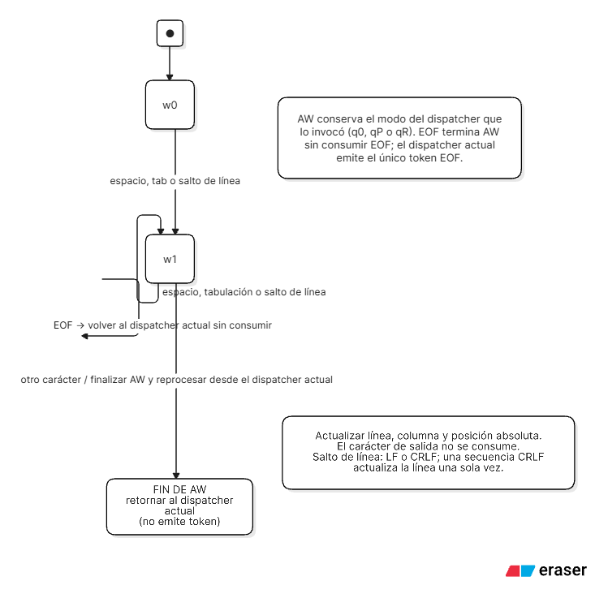
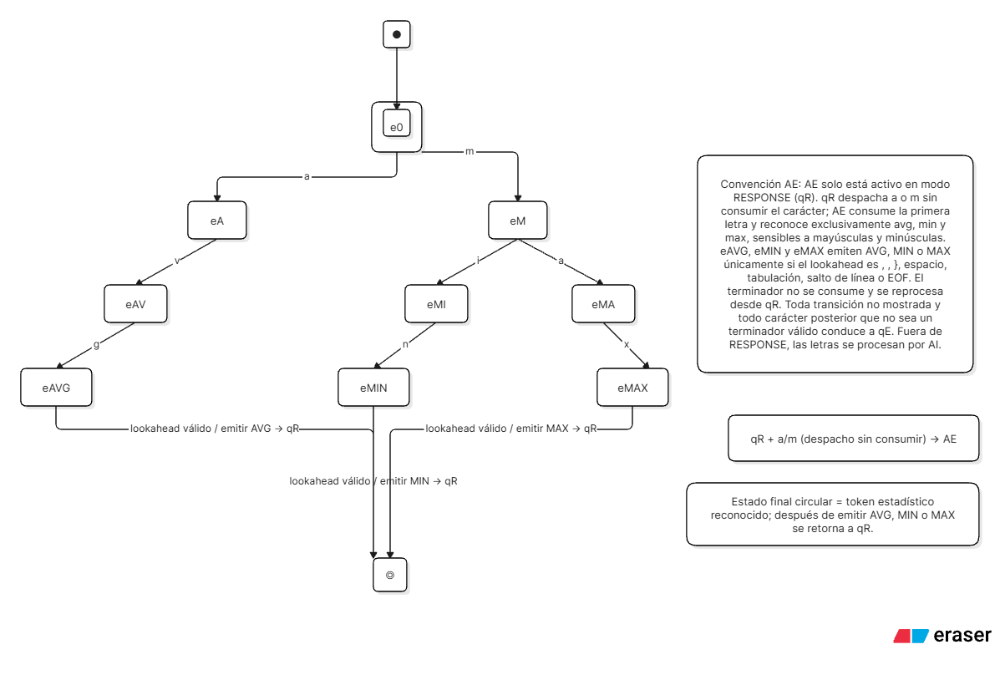

# Diagramas de automatas definitivos

Los siguientes archivos corresponden a los esquemas aprobados durante la revision del lexer. El estado `qE` de los diagramas representa terminacion por error lexico; la implementacion lanza `CompilationError` inmediatamente en lugar de consumir indefinidamente dentro de un estado trampa.

## Dispatcher principal

## AD - Directivas

## AI - Identificadores de variables

AI reconoce `[A-Za-z][A-Za-z0-9_]*`: la primera posicion debe ser una letra ASCII y las siguientes pueden incluir letras, digitos o guion bajo.

## AN - Numeros

## AS - Simbolos

## AW - Espacios

## AE - Estadisticos de RESPONSE

## Correspondencia con el codigo

| Diagrama | Implementacion |
|---|---|
| Dispatcher q0/qP/qR | modos de `lexer.py` |
| AD | escaneo de directivas |
| AI | escaneo de VARIABLE |
| AN | escaneo de NUMBER |
| AS | escaneo de simbolos |
| AW | consumo de whitespace |
| AE | escaneo de AVG/MIN/MAX en RESPONSE |
